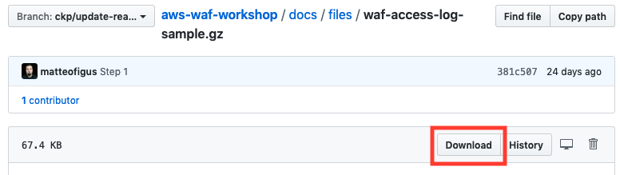
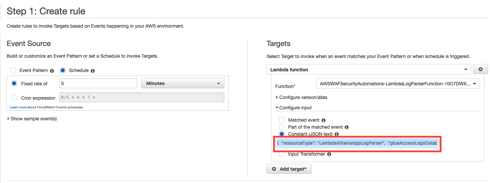

# Step 1 - Getting Started with AWS WAF Security Automations Solution

## Introduction

In this Step you will associate AWS WAF with the Application Load Balancer (ALB) of the sample application, then explore how the AWS WAF can protect against malicious requests containing SQL Injection or Cross Site Scripting attacks, and finally examine how the Security Automation Solution updates the AWS WAF ruleset to protect against HTTP Floods, Scanners and Probes.

## 1.1 Associate the solution's AWS WAF Web ACL with your ALB

The AWS WAF can be used with either API Gateway, Amazon CloudFront or an Application Load Balancer. In this example, we are using AWS WAF with an Application Load Balancer. Before the AWS WAF can receive requests, you must add the Application Load Balancer to the AWS WAF Resource.

After deploying the Web App, look at the Main Stack Outputs tab. You should have a value called `TheSiteUrl`. That is the address of the Application Load Balancer sitting on top of the Web App. Take note of that URL.

Next, you need to associate the solution's AWS WAF Web ACL with your ALB. For that:
* Go to the [AWS WAF console](https://console.aws.amazon.com/wafv2/home?#/webacls)
* Check if the region drop-down filter (not the one on the top, the one in the page) is selected with your region as value. For instance, "EU (Ireland)"
* Select the solution's WebACL - for instance "AWSWAFSecurityAutomations"
* On the right panel, select the "Rules" tab
* Scroll down to "AWS resources using this web ACL" section and click the "Add association" button
* On the "Resource type" drop-down, select "Application load balancer"
* On the "Resource" drop-down, select the ALB you've created
* Finally, click the "Add" button.


## 1.2 SQL Injection and Cross Site Scripting (XSS)

SQL Injection and XSS are two common attacks. The AWS WAF Security Automation Solution creates rules in AWS WAF to deny requests that contain SQL Injection or XSS. We will try two attacks against our sample application to demonstrate this.

Access the `site-url` endpoint and include bad signatures to the requests. You can use, for example:

* SQL Injection: `<your-endpoint>/?username=1'%20or%20'1'%20=%20'1&password=1'%20or%20'1'%20=%20'1'` <!-- pragma: allowlist secret -->
* XSS: `<your-endpoint>/?<SCRIPT>alert(“Cookie”+document.cookie)</SCRIPT>`

Optional Extension - Try and find an input form on the juice site to perform a XSS attack. See if your WAF blocks the malicious request.
If you bypass the WAF by accessing the EC2 instance directly, you will see the a successfull attack.

## 1.3 HTTP Flood (AWS Lambda log parser)

HTTP floods are a type of denial-of-service attack where an application receives a large volume of requests intended to exhaust the resources of an application, preventing it from handling requests from legitimate users.
We will demonstrate functionality provided by the Security Automation Solution to detect this type of attack and block the responsible IP address in AWS WAF.

Rather than execute an HTTP Flood attack on our sample application, we can simulate one by providing an example log file. This will be processed by the Security Automation Solution.

* Go to the CloudFormation Console, and inspect the WAF Automation stack's `Outputs` tab to find the value defined for `WafLogBucket`. Note this name. You will need it next.
* Download [this file](files/waf-access-log-sample.gz) to your machine.



> Note that this file is intentionally compressed. Do not decompress it before reuploading it

* Upload the file to the S3 bucket you noted down in the previous step.
    * To upload the file to the S3 bucket via the console, navigate to the [S3 Console page](https://s3.console.aws.amazon.com/s3/)
    * Select the bucket you noted in the previous step.
    * Select `upload`, then select the `waf-access-log-sample.gz` file.
* The lambda function is triggered by the creation of a new file in the S3 Bucket. Wait a few seconds while the log parser function processes the new WAF log file.
* Check if the file `<stack_name>-waf_log_out.json` was added to the same bucket
* Check the [AWS WAF console](https://console.aws.amazon.com/wafv2/home?#/webacls) (you may need to change the filter to WAF resources in your chosen region) to see if `HTTP Flood` rule contains any IP listed.

## 1.4 Scanners & Probe (Amazon Athena log parser)

Scanners and Probes are used by malicious actors to search for common and known vulnerabilities in websites. A site targeted by a Scanner or Probe will generate a large number of HTTP errors in the 400 range. The Security Automation Solution monitors for this uptick in errors, and blocks the responsible IP address.

To test Scanners & Probe, you can simulate a CloudWatch event running a query in a bucket that contains a sample access log file.
For that:
* Go to the S3 bucket that you set as Access Log Bucket. If you don't remember, go to stack's `Outputs` tab and search for the value defined for `AppAccessLogBucket`
* Create a new folder and name it AWSLogs and upload [this file](files/alb-access-log-sample.gz) to it.

This file will be processed during the next scheduled *Scanner and Probe* scan. Rather than wait, we will run it on demand.
We will simulate the generation of a CloudWatch scheduled event.

The Athena Log Parser is initiated by a Cloudwatch event, which invokes a Lambda to perform the query. We will create a test event in this Lambda to mimic the Cloudwatch Event.
* Find the [CloudWatch Event in the Console](https://eu-west-1.console.aws.amazon.com/cloudwatch/home#rules:). It will be prefixed `AWSWAFSecurityAutomations-LambdaAthenaAppLogParser`.
* We want the input generated by this Cloud Watch Event. Select `Actions > Edit`.

* Copy the Input. We will need it for the next step


It should look similar to this sample. Note that your input will be specific to your deployment.
```json
{
    "resourceType": "LambdaAthenaAppLogParser",
    "glueAccessLogsDatabase": "awswafsecurityautomations_avyass",
    "accessLogBucket": "dfghfdfgdsfgdsdfgghhnhhjhgsfdaseratrytq5weds",
    "logParserQuery": "37681d96-7a0d-42b2-820c-6c624c11ce11"
}
```

* Go to the [AWS Lambda console](https://console.aws.amazon.com/lambda/home)
* Open the `<stack_name>-LambdaLogParserFunction-<ID>` lambda function
* [Create a Lambda Test Event](https://docs.aws.amazon.com/lambda/latest/dg/getting-started-create-function.html#get-started-invoke-manually). Replace the sample input with the Cloud Watch Event input you copied in the previous step.
* Run the lambda function using the same event data used by the scheduled event
* Wait a few seconds (while Athena processes the data, save the result back on S3 and the log parser function is called again to process the result file)
* Go to [AWS WAF console](https://console.aws.amazon.com/wafv2/home?#/webacls) and check if `Scanners & Probes` rule contains any IP listed

# [Next step](step-2.md)
