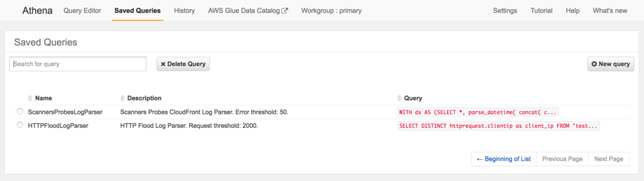
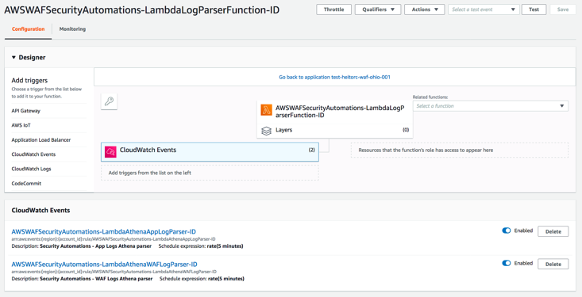
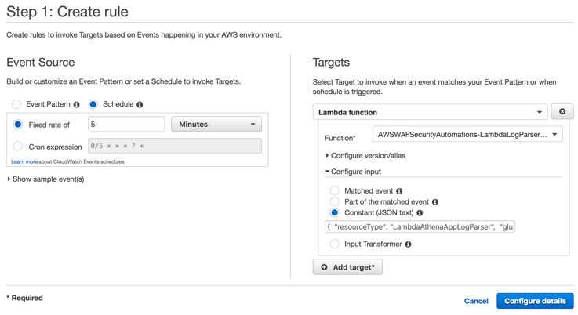

# Step 2 - Customising and extending AWS WAF Security Automations Solution

In this step, you will configure the WAF Security Automation Solution. Once you have configured the HTTP Flood Protection and Probe/Scanner Log Parser, you will test this new configuration.

## 2.1.1 Customise HTTP Flood Protection (AWS Lambda Log Parser)

The HTTP Flood protection provided by the Security Automation Solution can be configured. In this step, you will explore the possible configuration options. [See the documentation](https://docs.aws.amazon.com/solutions/latest/aws-waf-security-automations/appendix-c.html) for a complete list


The HTTP Flood log parser comes with some extensions points, they are:

* Request Threshold: the maximum acceptable requests per five minutes per IP address.
* Block Period: the period (in minutes) to block applicable IP addresses.
* Ignored Suffixes: requests accessing this type of resource will not count to request threshold. By default, this list is empty.
* URI List: use this to define a custom request threshold and block period for specifics URLs. By default, this list is empty.

The goal now is to apply customisations and check how it affects the log parser behavior.


### 2.1.2 Customising the HTTP Log Parser

In this step you will edit the configuration file for the HTTP Log parser. This configuration is used by the Lambda Log Parser when processing log files.

* Go to the S3 bucket used for WAF Logs Bucket. To check it's name, go to stack's Outputs tab and search for the value defined for WafLogBucket;
* Download the configuration file `<stack_name>-waf_log_conf.json`;
* Make your changes (ex: change requestThreshold to 100);
* Overwrite the configuration file on S3 bucket by uploading the new `<stack_name>-waf_log_conf.json` back to WAF Logs Bucket.

Here is a sample of changed file:

```json
{
  "general": {
    "requestThreshold": 2000,
    "blockPeriod": 240,
    "ignoredSufixes": [".css", ".js", ".jpg", ".png", ".gif"]
  },
  "uriList": {
    "/search": {
      "errorTreshold": 500,
      "blockPeriod":600
    }
  }
}
```

### 2.1.3 Testing the new rules

To test the HTTP Flood protection you customised earlier in this step, you will generate a large number of requests. The Flood Protection should add the source IP of the requests to a deny list.

We will use [Apache AB](https://httpd.apache.org/docs/2.4/programs/ab.html).
Apache AB is a tool for benchmarking a web server.  You will use it to generate a specified number of HTTP requests against your sample Application

> ⚠️ **Warning**: Do not run the benchmarking tool from your local machine! \
> Doing so will generate a large amount of traffic on your local network. \
> Use the EC2 instance of the Sample Web App to perform the requests against the external endpoint.

You will use [Systems Manager Session Manager](https://console.aws.amazon.com/systems-manager/session-manager/start-session) to connect to the instance and run the `ab` benchmarking tool. Apache AB is pre-installed on the instance.

Run against your endpoint 50,000 requests, with concurrency 100.
```bash
# Note the trailing slash
ab -n 50000 -c 100 <your-endpoint>/
```

* After a couple of minutes (time necessary to ALB deliver the access logs to S3), go to AWS WAF console and check if HTTP Flood rule contains your EC2 instance IP listed.

* Try to access <your-endpoint> from the instance you've sent the requests:
```bash
curl -s -o /dev/null -w "Return Code: %{http_code}\n" <your-endpoint>
```

## 2.2 Customising Scanners and Probes


Now you will customise our Scanner and Probe rules. These use Amazon Athena to query the logs generated by an application.
The solutions refer to Athena by a saved query ID. As Athena doesn't allow you to change saved queries, you need to create a new query and update the Athena log parser event to use the new query ID.

By customising the query performed by Athena, you can specify the rules for blocking scanners and probes. For further details, [see the documentation](https://docs.aws.amazon.com/solutions/latest/aws-waf-security-automations/appendix-d.html)

### 2.2.1
* Navigate to the Amazon Athena console, select the Saved Queries tab;
* Select the query you want to customise (ScannersProbesLogParser);



* Apply your changes (ex: change from `COUNT(*)>=50` to `COUNT(*)>=500`);
* Save the new Athena Query and copy the new query ID.


> NOTE: The query ID is part of the URL when you access the saved query (https://console.aws.amazon.com/athena/home?force#query/saved/**_query_id_**). Alternatively, you can use the `get-named-query CLI command`;


* Navigate to LogParser events and select the corresponding event (ScannerProbe);



* Edit the event data to point to the new Query ID copied above;



Save the new event data;

The Log Parser will now process logs using your new Athena Query.

Done? Great work! Continue to the last challenge
# [Next step](step-3.md)
